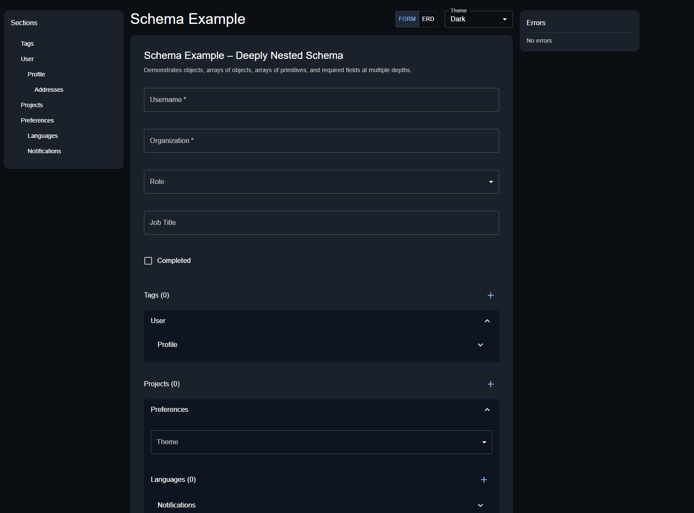
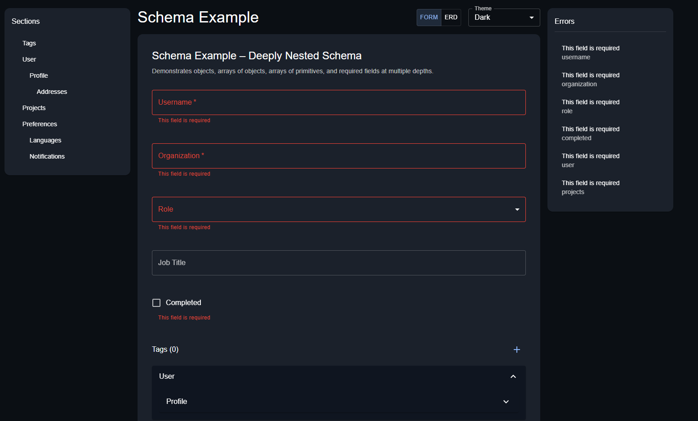
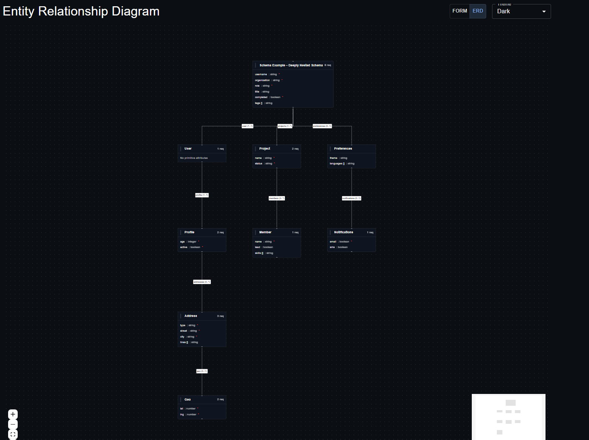
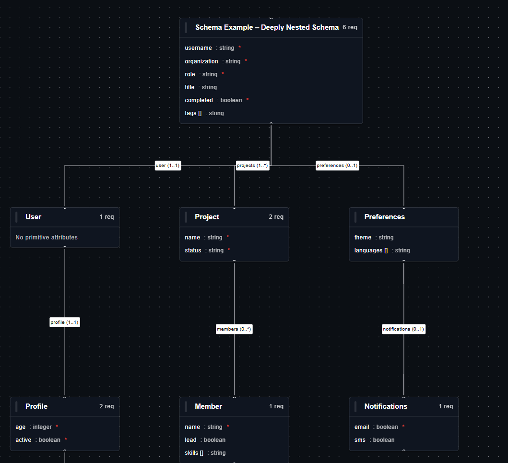

# Schema Example

This is an MVP on how to render JSON schemas in React. By leveraging dynamic form generation, to rendering an entity relationship
diagram, we can build a rich UI.

## Main Page

For large schemas, navigation via scrolling is a nightmare. To combat this, the "Sections" panel on the left allows users to
click on a "header" to navigate to it. Additionally, arrays of objects will render "Item 1", "Item 2", etc. to help traverse more
complex schemas.

Similarly, users should be able to navigate to errors. On the right there's an "errors" panel. As errors are addressed,
this panel will update in real-time.

To help visualize how the data is structured, an entity relationship diagram is rendered as a separate "view mode"

